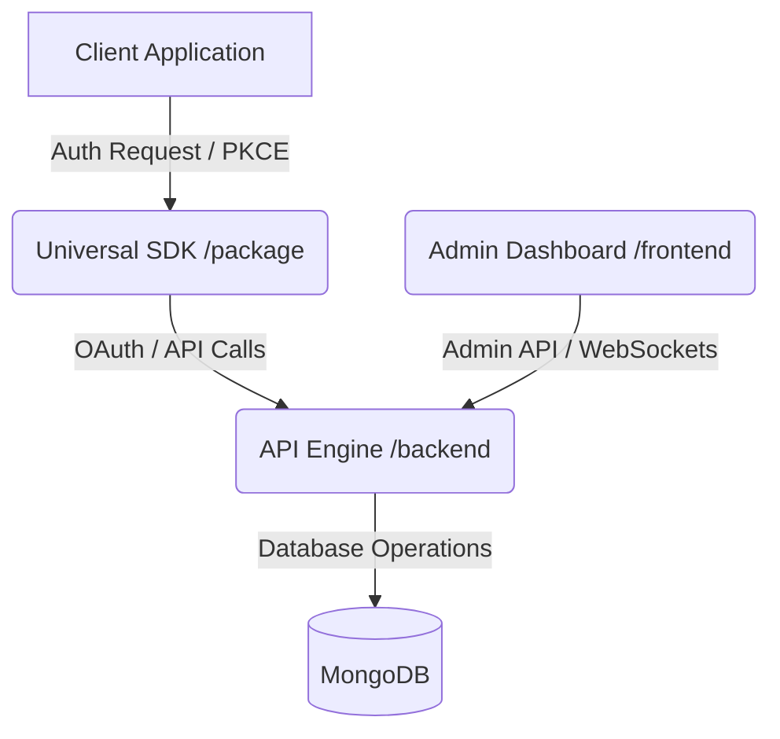
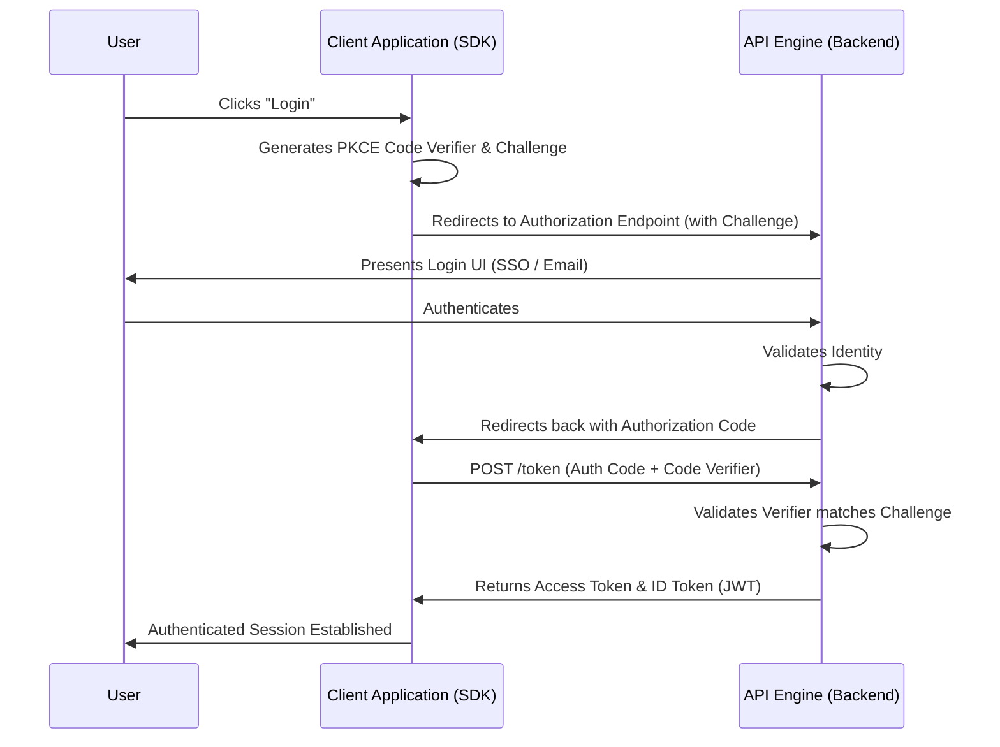

# Architecture & Design

This document details the internal architecture and design patterns used in AuthSphere.

## Monorepo Structure

AuthSphere is organized into several key packages:

- `backend`: The Core API Engine (Node.js/Express).
- `frontend`: The Command Center (React 19).
- `package`: The Universal SDK for client applications.
- `test`: A reference implementation.

## System Architecture

AuthSphere follows a modular architecture designed for scalability, multi-tenant isolation, and secure identity management.

### 1. API Engine (`/backend`)
The backend is built with Node.js and Express. It serves as the core identity provider, handling:
- **Authentication Lifecycle**: Manages OAuth 2.0 handshakes, OpenID Connect (OIDC), OTP generation, and token signing using RSA-2048 and AES-256-GCM encryption.
- **Multi-Tenant Isolation**: Cryptographically isolated environments for different projects/tenants.
- **Live Telemetry**: Streams real-time authentication events and diagnostics via WebSockets to the Admin Dashboard.
- **Database Interaction**: Communicates with MongoDB to store user identities, tenant configurations, and audit logs securely (passwords hashed via Argon2id/Bcrypt).

### 2. Admin Dashboard (`/frontend`)
A React 19 application utilizing Vite, Tailwind CSS v4, and Zustand. It serves as the command center for tenant administrators to:
- Manage identity records (account blocking, verification overrides, etc.).
- Customize email templates with a live preview editor.
- Monitor live authentication events via the WebSocket telemetry stream.
- Configure OAuth providers (Google, GitHub, Discord).

### 3. Universal SDK (`/package`)
A lightweight, framework-agnostic client SDK that simplifies integration for developers. It handles:
- Initialization with project-specific keys and configurations.
- Abstracting the complexity of PKCE (Proof Key for Code Exchange) and OAuth flows.
- Transparently managing token acquisition and session states.

### 4. Reference Implementation (`/test`)
A sample application to demonstrate real-world usage of the Universal SDK integrating with the API Engine.

## Authentication Workflow (PKCE Flow)

The primary authentication mechanism leverages OAuth 2.0 with PKCE to securely authenticate users without exposing client secrets in public applications (like SPAs or mobile apps).

